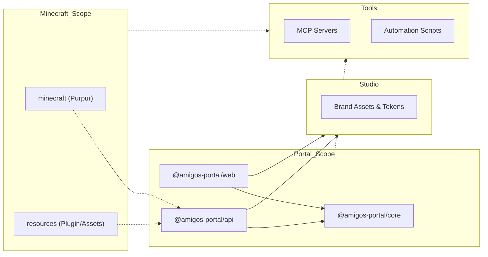

# Technical Architecture

## 1. Executive Summary

**Amigos Do Mine** is an integrated Minecraft ecosystem that combines a custom game experience with a modern web portal. The project is built on a **Monorepo** architecture using **PNPM Workspaces** and **Turborepo**, prioritizing high performance, modularity, and a **Single Source of Truth (SSOT)** strategy.

The architecture ensures that the game server, assets, and web interface are strictly synchronized and follow **SOLID Principles**.

---

## 2. Monorepo Structure & Application Roles

The codebase is organized into specialized workspaces. The following diagram illustrates the package relationships and dependency flow:

| Directory              | Package Name              | Role          | Responsibility                                                 |
| :--------------------- | :------------------------ | :------------ | :------------------------------------------------------------- |
| portal/apps/web        | @amigos-portal/web        | **Frontend**  | React 19 SPA. Dashboard for server control and player stats.   |
| portal/apps/api        | @amigos-portal/api        | **Backend**   | Fastify v5 API. Handles auth, data, and serves resource packs. |
| portal/packages/core   | @amigos-portal/core       | **Library**   | SSOT for shared schemas (Zod) and TypeScript types.            |
| minecraft/             | @amigos-do-mine/minecraft | **Server**    | Dockerized Purpur 1.21+ Minecraft server.                      |
| resources/             | @amigos-do-mine/resources | **Assets**    | Custom plugins (AmigosPlugin) and MCreator assets.             |
| studio/                | @amigos-do-mine/studio    | **Tooling**   | Brand tokens, design assets, and self-hosted Penpot.           |
| tools/                 | @amigos-do-mine/tools     | **Tooling**   | MCP infrastructure and project automation scripts.             |

---

## 3. The "Develop-Host-Consume" Flow ♻️

This is our specialized pipeline for Minecraft assets:

1.  **Cook**: Create a 3D model or texture in `resources/`.
2.  **Pack**: Automation scripts bundle the assets into a `.zip` resource pack.
3.  **Serve**: The file is hosted by the `@amigos-portal/api` public folder.
4.  **Eat**: The Minecraft server (`minecraft/`) detects the update and instructs connected players to download the new pack automatically.

---

## 4. Technology Stack

### 4.1. Core Engine
- **Runtime**: Node.js 22+ (LTS).
- **Package Manager**: PNPM v10 (Strict dependency management).
- **Task Orchestrator**: **Turborepo** (Optimized caching and parallel execution).
- **Tooling**: TypeScript 6, ESLint 9, Prettier 3.

### 4.2. Backend (API Layer)
- **Framework**: Fastify v5.
- **ORM/ODM**: Mongoose with MongoDB (Replica Set).
- **Validation**: Zod (Integrated via `@amigos-portal/core`).
- **Processing**: BullMQ + Redis for asynchronous tasks.

### 4.3. Frontend (UI Layer)
- **Framework**: React 19.
- **State Management**: Zustand.
- **Styling**: TailwindCSS v4.
- **Animations**: GSAP for high-fidelity feedback.

### 4.4. Game Server
- **Platform**: Purpur 1.21+ (Fork of Paper/Spigot).
- **Runtime**: Java 21 (Eclipse Temurin).
- **Customization**: "Amigos Plugin" developed in Kotlin/Java.

---

## 5. Infrastructure & Docker 🐳

We run on a unified network called `amigosdomine_network`.

- **Persistence**:
    - **Minecraft**: Uses Bind Mounts (`./minecraft:/data`) for easy host-side editing.
    - **Databases**: Use Named Volumes (`mongo_data`) for data safety.
- **Security**: In production, the Minecraft container runs as a restricted `minecraft` user.
- **Hardware Access**: Mapped `eudev-libs` for hardware monitoring (OSHI).

---

_Last Updated: May 2026_
