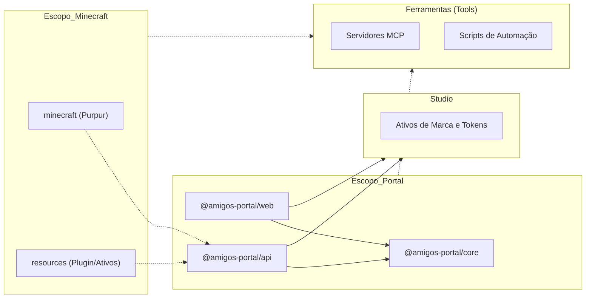

# Arquitetura Técnica

## 1. Resumo Executivo

O **Amigos Do Mine** é um ecossistema Minecraft integrado que combina uma experiência de jogo customizada com um portal web moderno. O sistema é construído sobre uma arquitetura de **Monorepo** utilizando **PNPM Workspaces** e **Turborepo**, priorizando alta performance, modularidade e uma estratégia de **Fonte Única de Verdade (SSOT)**.

A arquitetura garante que o servidor de jogo, os ativos e a interface web estejam estritamente sincronizados e sigam os **Princípios SOLID**.

---

## 2. Estrutura do Monorepo & Papéis das Aplicações

A base de código é organizada em workspaces especializados. O diagrama a seguir ilustra as relações entre os pacotes e o fluxo de dependências:

| Diretório              | Nome do Pacote            | Papel          | Responsabilidade                                               |
| :--------------------- | :------------------------ | :------------- | :------------------------------------------------------------- |
| portal/apps/web        | @amigos-portal/web        | **Frontend**   | SPA React 19. Dashboard para controle do servidor e estatísticas. |
| portal/apps/api        | @amigos-portal/api        | **Backend**    | API Fastify v5. Gerencia auth, dados e serve os resource packs. |
| portal/packages/core   | @amigos-portal/core       | **Biblioteca** | SSOT para esquemas compartilhados (Zod) e tipos TypeScript.    |
| minecraft/             | @amigos-do-mine/minecraft | **Servidor**   | Servidor Minecraft Purpur 1.21+ dockerizado.                   |
| resources/             | @amigos-do-mine/resources | **Ativos**     | Plugins customizados (AmigosPlugin) e ativos do MCreator.      |
| studio/                | @amigos-do-mine/studio    | **Tooling**    | Tokens de marca, ativos de design e Penpot self-hosted.        |
| tools/                 | @amigos-do-mine/tools     | **Tooling**    | Infraestrutura MCP e scripts de automação do projeto.          |

---

## 3. O Fluxo "Desenvolver-Hospedar-Consumir" ♻️

Este é o nosso pipeline especializado para ativos do Minecraft:

1.  **Cozinhar (Cook)**: Criar um modelo 3D ou textura em `resources/`.
2.  **Empacotar (Pack)**: Scripts de automação agrupam os ativos em um resource pack `.zip`.
3.  **Servir (Serve)**: O arquivo é hospedado pela pasta pública da `@amigos-portal/api`.
4.  **Consumir (Eat)**: O servidor Minecraft (`minecraft/`) detecta a atualização e instrui os jogadores conectados a baixarem o novo pack automaticamente.

---

## 4. Stack Tecnológica

### 4.1. Core Engine
- **Runtime**: Node.js 22+ (LTS).
- **Gerenciador de Pacotes**: PNPM v10 (Gestão estrita de dependências).
- **Orquestrador de Tarefas**: **Turborepo** (Cache otimizado e execução paralela).
- **Ferramental**: TypeScript 6, ESLint 9, Prettier 3.

### 4.2. Backend (Camada de API)
- **Framework**: Fastify v5.
- **ORM/ODM**: Mongoose com MongoDB (Replica Set).
- **Validação**: Zod (Integrado via `@amigos-portal/core`).
- **Processamento**: BullMQ + Redis para tarefas assíncronas.

### 4.3. Frontend (Camada de UI)
- **Framework**: React 19.
- **Gestão de Estado**: Zustand.
- **Estilização**: TailwindCSS v4.
- **Animações**: GSAP para feedback de alta fidelidade.

### 4.4. Servidor de Jogo
- **Plataforma**: Purpur 1.21+ (Fork do Paper/Spigot).
- **Runtime**: Java 21 (Eclipse Temurin).
- **Customização**: "Amigos Plugin" desenvolvido em Kotlin/Java.

---

## 5. Infraestrutura & Docker 🐳

Rodamos em uma rede unificada chamada `amigosdomine_network`.

- **Persistência**:
    - **Minecraft**: Utiliza Bind Mounts (`./minecraft:/data`) para edição fácil via host.
    - **Bancos de Dados**: Utilizam Volumes Nomeados (`mongo_data`) para segurança dos dados.
- **Segurança**: Em produção, o container do Minecraft roda como um usuário restrito `minecraft`.
- **Acesso ao Hardware**: `eudev-libs` mapeadas para monitoramento de hardware (OSHI).

---

_Última Atualização: Maio de 2026_
