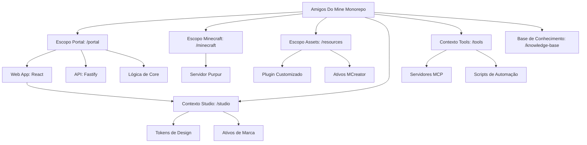

# Introdução

Bem-vindo ao ambiente de desenvolvimento do **Amigos Do Mine**. Este projeto é um ecossistema Minecraft especializado, contando com um servidor de jogo customizado e um portal web moderno para gestão.

## Estrutura de Contextos

Utilizamos **PNPM Workspaces** para organizar nossa base de código em contextos especializados. Esta arquitetura garante escalabilidade e uma separação clara de responsabilidades entre o servidor de jogo, seus ativos e a infraestrutura web.



### Escopo Portal (portal/)
Gerencia a infraestrutura web.
- **`@amigos-portal/web`**: SPA React para o dashboard do jogador e controle administrativo.
- **`@amigos-portal/api`**: API REST Fastify para autenticação, dados e entrega de ativos.
- **`@amigos-portal/core`**: Lógica de domínio compartilhada e esquemas SSOT.

### Escopo Minecraft (minecraft/)
O ambiente core do servidor de jogo.
- **Purpur 1.21+**: Um fork de alta performance do servidor Minecraft.
- **Dockerizado**: Totalmente conteinerizado para implantação consistente.

### Escopo Resources (resources/)
Onde a "mágica" acontece para a customização do jogo.
- **Amigos Plugin**: Lógica customizada para mecânicas de jogo e integração com o backend.
- **Resource Pack**: Modelos 3D e texturas customizadas construídas com MCreator.

---

## Início Rápido

Certifique-se de ter o **Node.js 22+**, **PNPM 10+** e **Docker** instalados.

1.  **Instalar Dependências:**
    ```bash
    pnpm install
    ```

2.  **Iniciar o Servidor Minecraft:**
    ```bash
    pnpm server:up
    ```

3.  **Build de Ativos do Jogo:**
    ```bash
    pnpm build:plugin
    pnpm build:resourcepack
    ```

Consulte o **[Cheat Sheet](./cheat-sheet.mdx)** para uma lista completa de comandos.

---
_Engenharia profissional para uma experiência de jogo polida._
