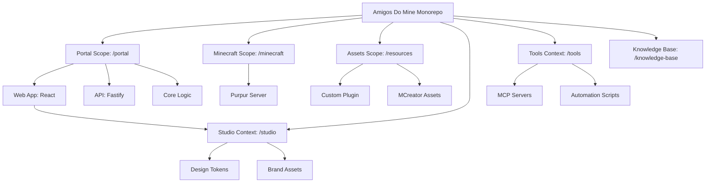

# Introduction

Welcome to the **Amigos Do Mine** development environment. This project is a specialized Minecraft ecosystem featuring a custom game server and a modern web management portal.

## Bounded Context Structure

We use **PNPM Workspaces** to organize our codebase into specialized contexts. This architecture ensures scalability and clear separation of concerns between the game server, its assets, and the web infrastructure.



### Portal Scope (portal/)
Manages the web infrastructure.
- **`@amigos-portal/web`**: React SPA for player dashboard and admin control.
- **`@amigos-portal/api`**: Fastify REST API for auth, data, and asset serving.
- **`@amigos-portal/core`**: Shared domain logic and SSOT schemas.

### Minecraft Scope (minecraft/)
The core game server environment.
- **Purpur 1.21+**: A high-performance Minecraft server fork.
- **Dockerized**: Fully containerized for consistent deployment.

### Resources Scope (resources/)
Where the "magic" happens for game customization.
- **Amigos Plugin**: Custom logic for game mechanics and backend integration.
- **Resource Pack**: Custom 3D models and textures built with MCreator.

---

## Quick Start

Ensure you have **Node.js 22+**, **PNPM 10+**, and **Docker** installed.

1.  **Install Dependencies:**
    ```bash
    pnpm install
    ```

2.  **Run the Minecraft Server:**
    ```bash
    pnpm server:up
    ```

3.  **Build Game Assets:**
    ```bash
    pnpm build:plugin
    pnpm build:resourcepack
    ```

Refer to the **[Cheat Sheet](./cheat-sheet.mdx)** for a complete list of commands.

---
_Professional engineering for a polished gaming experience._
